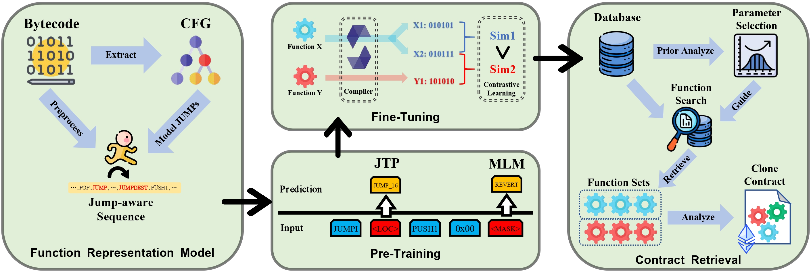

# SmartTrans



Official implementation of **SmartTrans: Advanced Similarity Analysis for Detecting Vulnerabilities in Ethereum Smart Contracts**.
The Model and Dataset are released at [NextCloud](https://cloud.vul337.team:8443/s/ywJwipTq7HR5AQK)

## Prerequisites

- Linux OS (Tested on Ubuntu 24.04.2 LTS)
- Python 3.8+
- PyTorch 1.10+ with CUDA 10.2+
- NVIDIA Drivers (Tested with 550.135)
- [Gigahorse-toolchain](https://github.com/nevillegrech/gigahorse-toolchain) (for bytecode CFG analysis)

## Quick Start

### Environment Setup

1. Create and activate conda environment:
```bash
conda create -n smarttrans python=3.8 -y
conda activate smarttrans
```

2. Install dependencies:
```bash
pip install tqdm pandas transformers faiss-gpu accelerate datasets wandb
```

3. Clone repository:
```bash
git clone https://github.com/vul337/SmartTrans.git && cd SmartTrans
```

4. Download and extract models and datasets:
Please download and extract the models from [NextCloud](https://cloud.vul337.team:8443/s/ywJwipTq7HR5AQK)
```bash
tar -xzvf *.tar.gz
mkdir index/
mv searching_index.index index/
```


### Usage

#### Analyzing Custom Smart Contracts
1. Preprocess bytecode using Gigahorse-toolchain (set `TEMP_PATH` in `1.Analyze_gigahorse.py` to point to Gigahorse's `.temp` directory)
```bash
python3 1.Analyze_gigahorse.py
```

2. Run preprocessing and inference:
```bash
python3 2.Preprocess.py
python3 3.SaveEmbedding.py
```

3. Retrieve similar functions:
```bash
python3 4.Retrieve.py
```

### Training

#### Pre-Training
```
train.sh
```

#### Finetuning
```
finetune.sh
```

## Reproducibility
The exact conda environment configuration is provided in `smarttrans_env.yaml`.


## Citation
If this work is helpful for your research, please consider citing the following BibTeX entry.

```
@article{chen2025smarttrans,
  title={SmartTrans: Advanced Similarity Analysis for Detecting Vulnerabilities in Ethereum Smart Contracts},
  author={Chen, Longfei and Wang, Hao and Zhou, Yuchen and Wong, Taiyu and Wang, Jialai and Zhang, Chao},
  journal={IEEE Transactions on Dependable and Secure Computing},
  year={2025},
  publisher={IEEE}
}
```